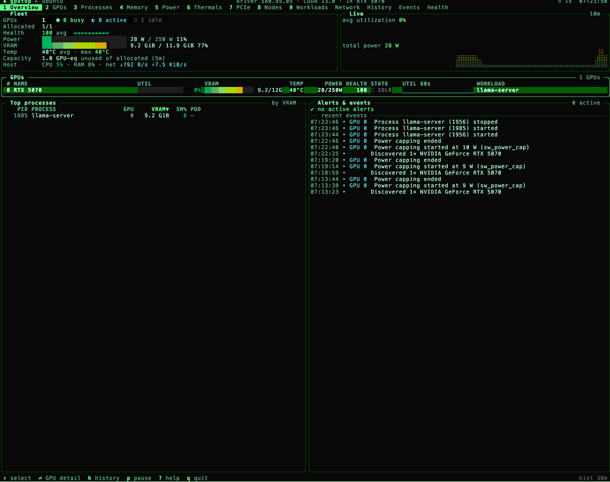
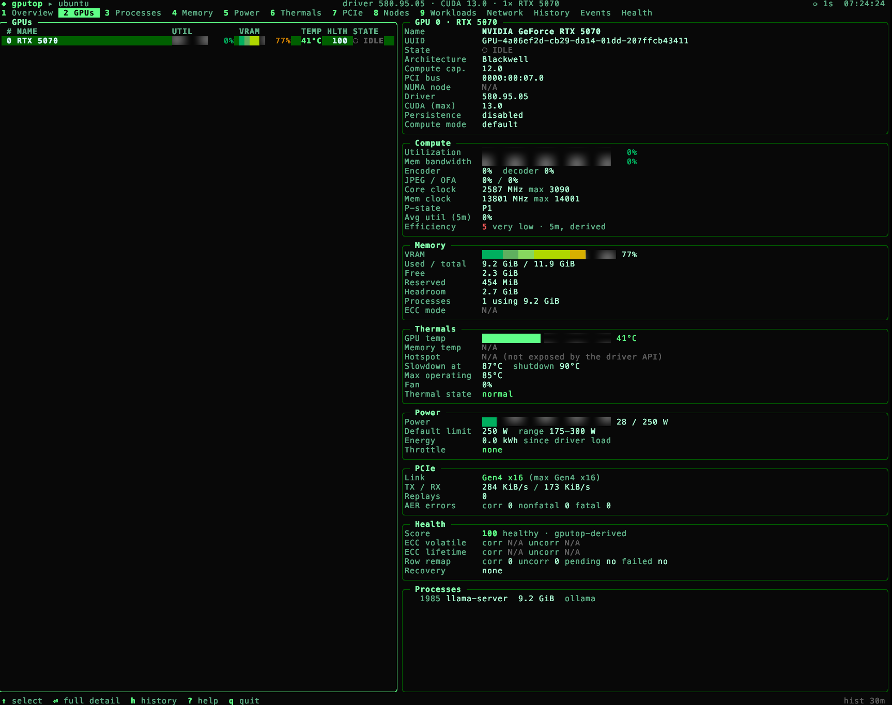
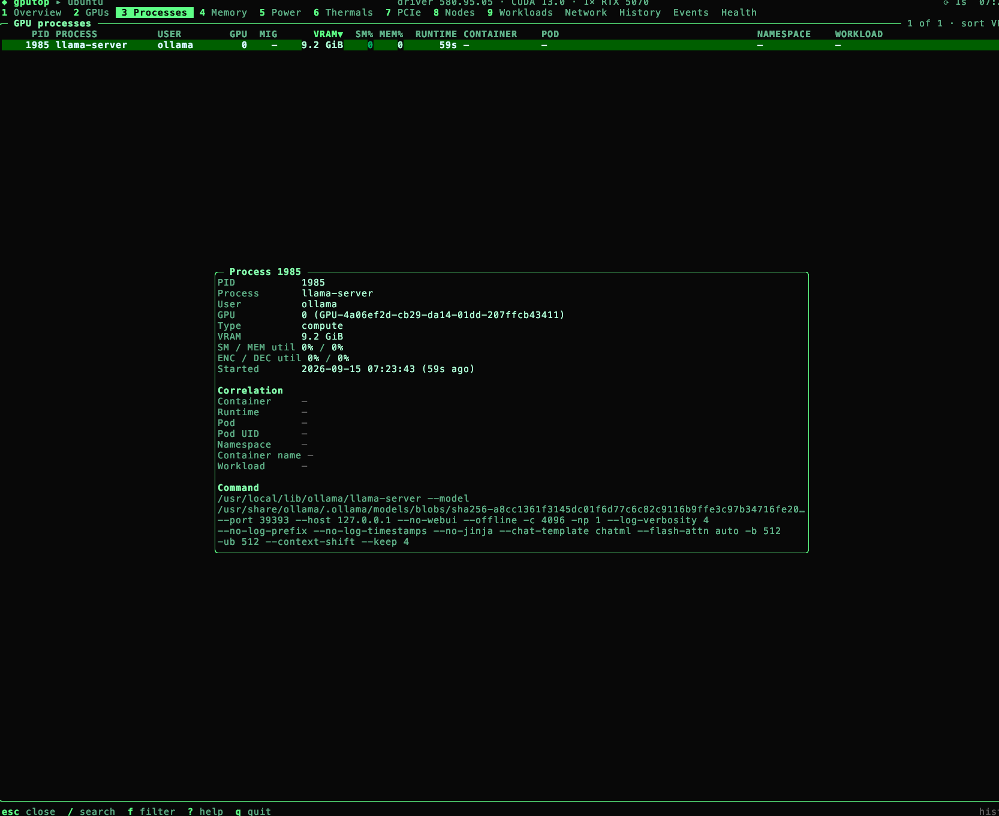
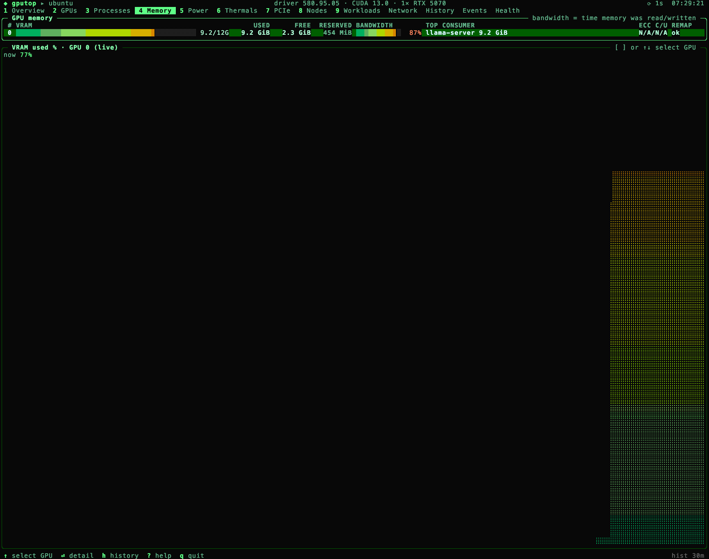
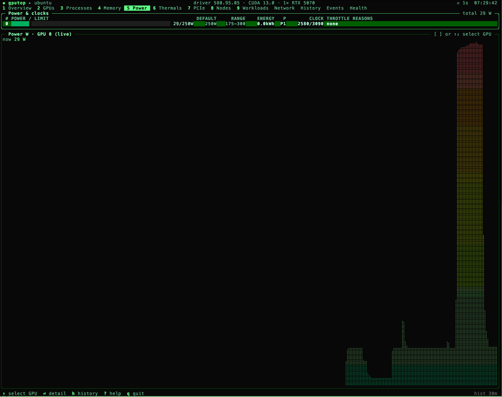
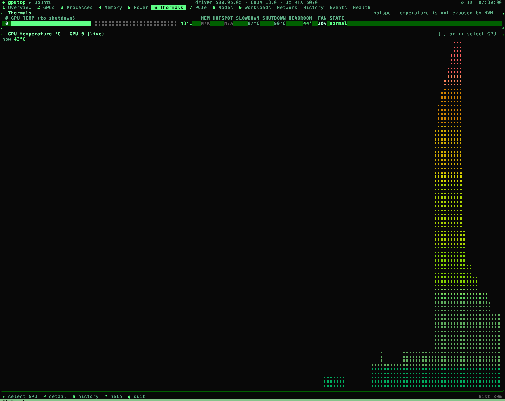

# gputop

**A fast, keyboard-first terminal monitor for GPU infrastructure.**

gputop is to GPUs what btop is to hosts: a dense, low-overhead TUI that answers
*"what is happening with my GPUs right now?"* and, with its built-in time
machine, *"what happened 15 minutes ago?"*

It supports **NVIDIA GPUs** (NVML, Linux) and **Apple silicon GPUs** (M1 and
later, macOS), detected automatically. No CUDA toolkit, DCGM, root or cgo
required.

<p align="center">
  
</p>

<details>
<summary>More screenshots</summary>

<p align="center">
  
  
  
  
  
</p>
</details>

## Install

Download a binary from the [latest release](https://github.com/riteshsonawane1372/gputop/releases/latest)
(`gputop-{linux,darwin}-{amd64,arm64}`):

```bash
curl -fLo gputop https://github.com/riteshsonawane1372/gputop/releases/latest/download/gputop-linux-amd64
chmod +x gputop && sudo install gputop /usr/local/bin/
```

Or with Go 1.25+: `go install github.com/riteshsonawane1372/gputop/cmd/gputop@latest`.
On macOS, clear the quarantine flag first: `xattr -d com.apple.quarantine gputop`.

**Requirements:** the NVIDIA driver on Linux (it provides `libnvidia-ml.so.1`),
or an Apple silicon Mac. In containers, use the NVIDIA Container Toolkit and
`--pid=host` so host PIDs resolve. If no GPU is found, gputop shows what it
checked and keeps monitoring the host.

## Quick start

```bash
gputop                        # interactive TUI
gputop --demo                 # simulated 8-GPU node: try it without hardware
gputop --once                 # one-shot text summary
gputop --once --json          # one JSON snapshot (gputop --json streams them)
gputop --service              # headless agent: HTTP API + Prometheus /metrics
gputop --remote gpu-node-01   # TUI for a remote agent
```

Press `?` for help. The essentials: `←` `→` switch tabs, `↑` `↓` move, `Enter`
opens detail, `/` searches, `f` filters (`gpu:0 user:alice ns:ml`), `s` sorts,
`h` opens history, `p` pauses, `q` quits. The mouse works too: click tabs, rows
and column headers, scroll with the wheel. Every key is rebindable.

## What you get

- **Every GPU at a glance**: utilization, VRAM, power, temperature, clocks,
  throttle reasons, PCIe, NVLink, MIG, ECC and Xid errors. Unsupported values
  show as `N/A`, never as `0`.
- **Processes and workloads**: which process, container, pod and workload owns
  each GPU and its VRAM.
- **Inference serving**: TTFT, inter-token latency, end-to-end and queue
  latency, tokens/s, queue depth and KV-cache usage from vLLM, SGLang, TGI and
  llama.cpp servers, discovered automatically from GPU processes.
- **History**: the last 30 minutes (configurable, persisted to disk). Scrub
  back in time with events on the timeline.
- **Health and alerts**: a 0–100 health score with itemized reasons, plus
  idle-but-allocated GPUs, stragglers and throttling.
- **Kubernetes**: k9s-style pod list, describe and logs for GPU pods.
- **Fleet**: a hardened agent (TLS, token auth, mTLS) with a JSON API and
  Prometheus metrics, and a remote TUI.
- **Dashboard**: the NVIDIA DCGM Grafana dashboard, in the terminal.

Tabs appear only when they have something to show: NVLink only with NVLink
hardware, Inference only when a server is found, and so on.

## Configuration

gputop reads `~/.config/gputop/config.yaml`. Every key is optional; start from
[`examples/config.yaml`](examples/config.yaml) or `gputop --print-config`.

```yaml
history:
  retention: 2h
theme:
  name: amber           # green, amber, ice, mono, dusk or your own
inference:
  endpoints:            # servers that discovery can't see
    - name: chat-api
      url: http://10.0.0.5:8000/metrics
```

## Documentation

| | |
|---|---|
| [Configuration](docs/configuration.md) | every option and bindable key |
| [Metrics & provenance](docs/metrics.md) | where each value comes from |
| [Inference serving](docs/inference.md) | TTFT, ITL, KV cache: supported servers and how values are computed |
| [Derived metrics](docs/derived-metrics.md) · [Health score](docs/health-score.md) | formulas and limitations |
| [Kubernetes](docs/kubernetes.md) | DaemonSet deployment and workload correlation |
| [Service & remote](docs/remote.md) | agent mode, security model, Prometheus |
| [JSON output](docs/json-schema.md) | the versioned snapshot schema |
| [Architecture](docs/architecture.md) · [Performance](docs/performance.md) | internals and overhead |
| [Themes](docs/themes.md) | built-in and custom color themes |

## Status

gputop is pre-1.0. NVIDIA support is tested against NVML's struct layouts and a
fake `libnvidia-ml` on amd64 and arm64, but not yet across real GPU
generations; please share results from `make test-nvidia`. Apple silicon
support, the health score, derived metrics, Kubernetes correlation and service
mode are experimental. Planned: DCGM, AMD and Intel providers, and packages.
See the [changelog](CHANGELOG.md).

## Development

```bash
make build            # bin/gputop
make test             # unit tests, no GPU needed (make race for -race)
make lint             # golangci-lint
./bin/gputop --demo   # work on the UI without hardware
```

See [CONTRIBUTING.md](CONTRIBUTING.md).

## License

Apache License 2.0; see [LICENSE](LICENSE). NVIDIA, NVML, CUDA and NVLink are
trademarks of NVIDIA Corporation. gputop is not affiliated with NVIDIA.
